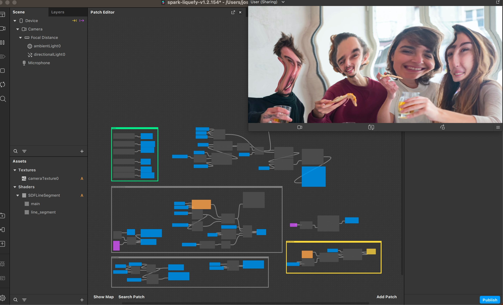
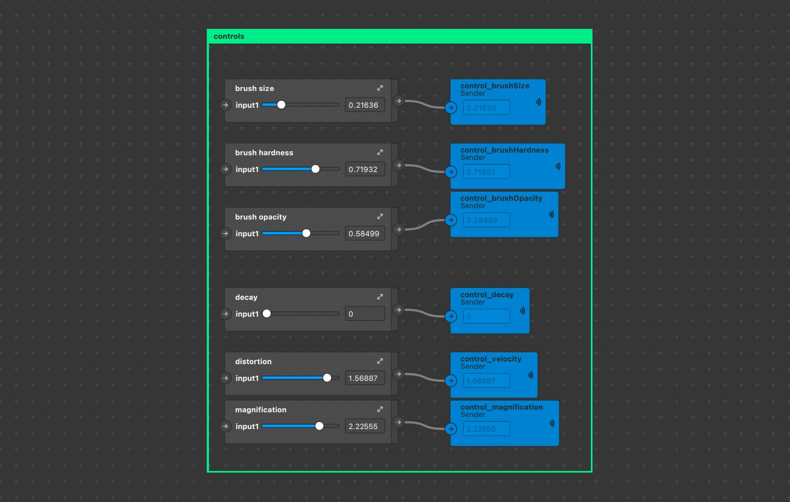

# Meta Spark Liquefy

This effect is like the liquefy filter in Photoshop. It lets the user smudge the camera texture by swiping their finger on the screen. 

[Demo video](https://youtu.be/3UbakQ7MHEw)

There are slider controls in the patch editor so you can easily adjust the parameters to fit your project.

Brush controls include size, hardness, and opacity. It makes smooth strokes even with fast movements, using an [SDF line segment](https://www.shadertoy.com/view/Wlfyzl) by Inigo Quilez. [Brush Demo](https://www.youtube.com/watch?v=ThGGqbRPysY&ab_channel=JoshBeckwith)

Decay will slowly return the distortion back to normal.

And of course the distortion slider controls the strength of the distortion.

## Inspiration

From Fabrice Neyret: https://www.shadertoy.com/view/sdjyRV

## Donations

If you used this in client projects, or simply enjoyed making effects with my open-source projects, please consider a donation or sponsorship. One-time donations can be made with PayPal. Subscriptions can be through PayPal or Github Sponsors (click the heart sponsor button at the top of the page).

