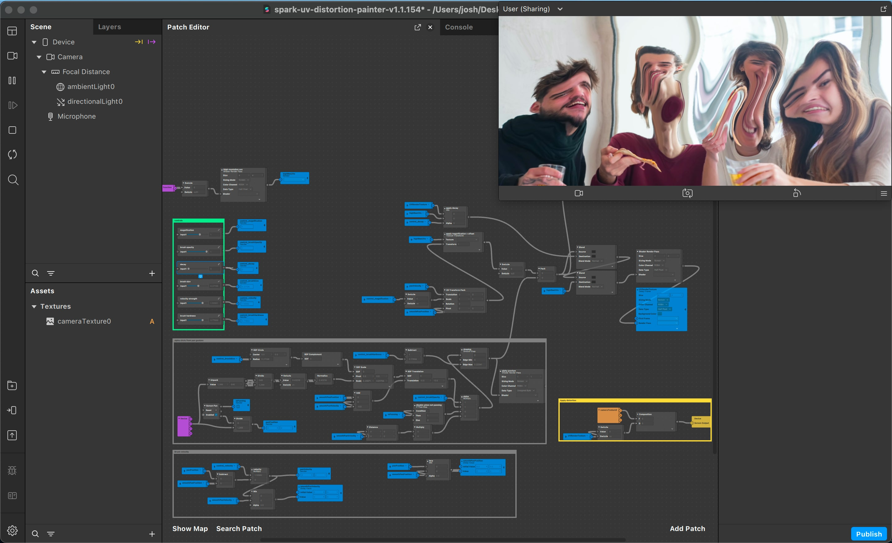

# Meta Spark UV Distortion Painter

This effect is a simple UV distortion painter, created from an SDF circle and some texture transforms. It's purely patch-based so it should be easy to understand by stepping through the node graph previews. 

It comes with some slider controls so you can play around with the effect in the simulator. 

Inspiration: https://www.shadertoy.com/view/sdjyRV

## Donations

If you used this in client projects, or simply enjoyed making effects with my open-source projects, please consider a donation or sponsorship. One-time donations can be made with PayPal. Subscriptions can be through PayPal or Github Sponsors (click the heart sponsor button at the top of the page).

